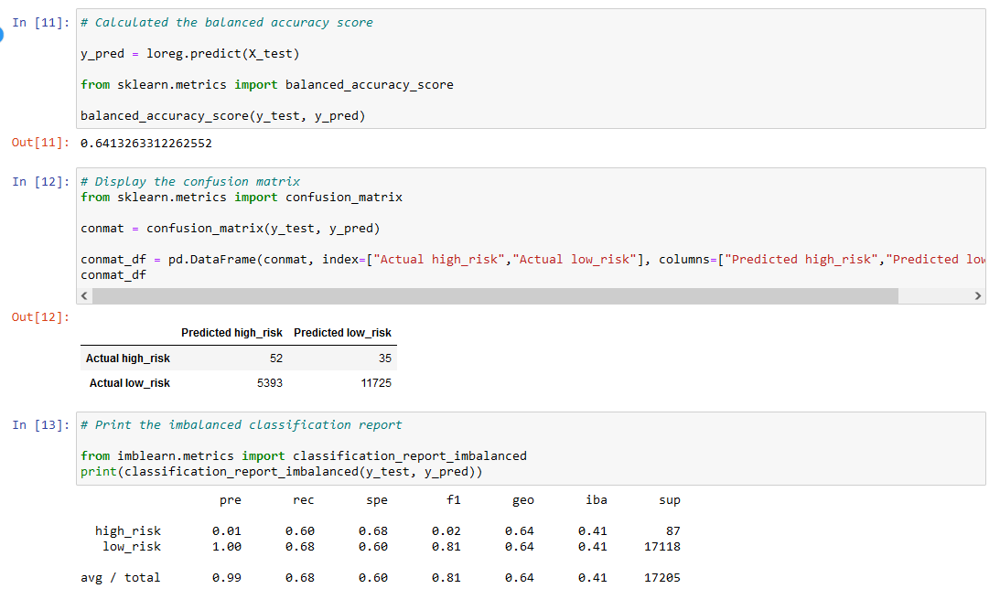
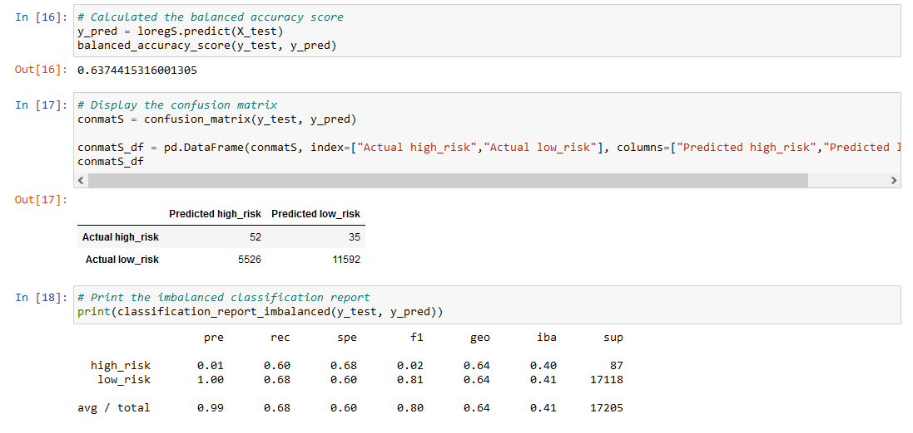
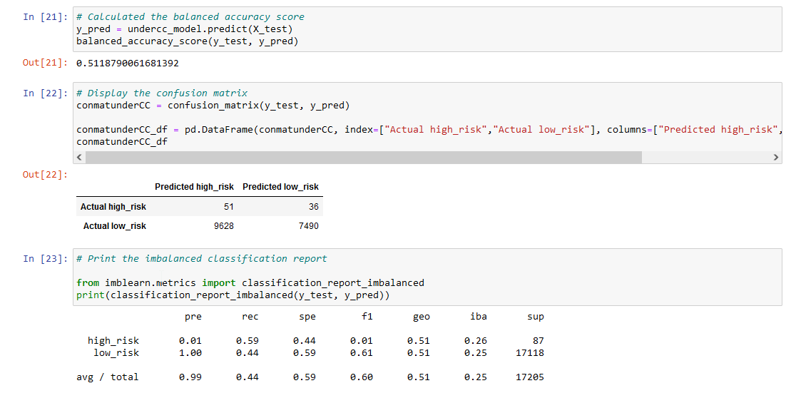
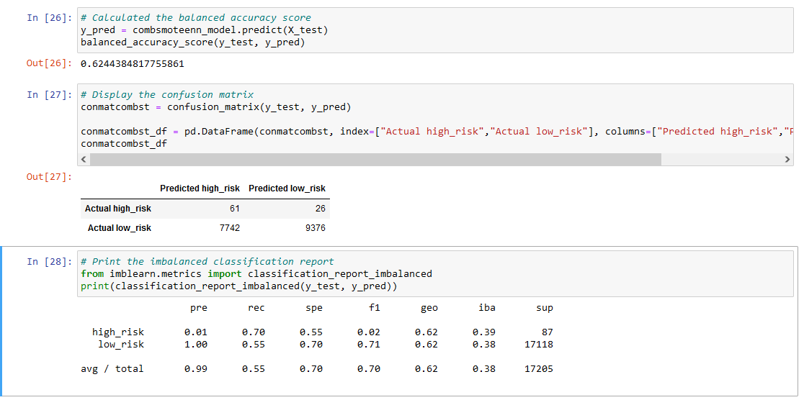
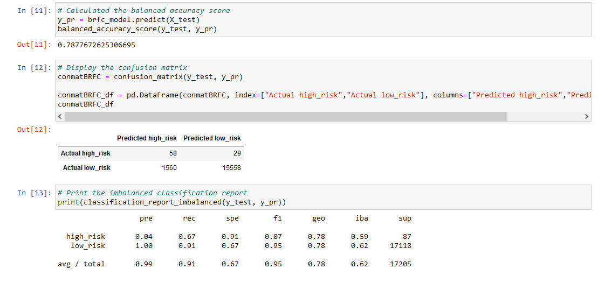
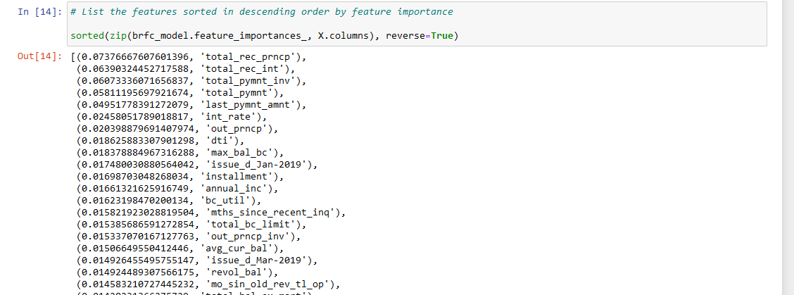
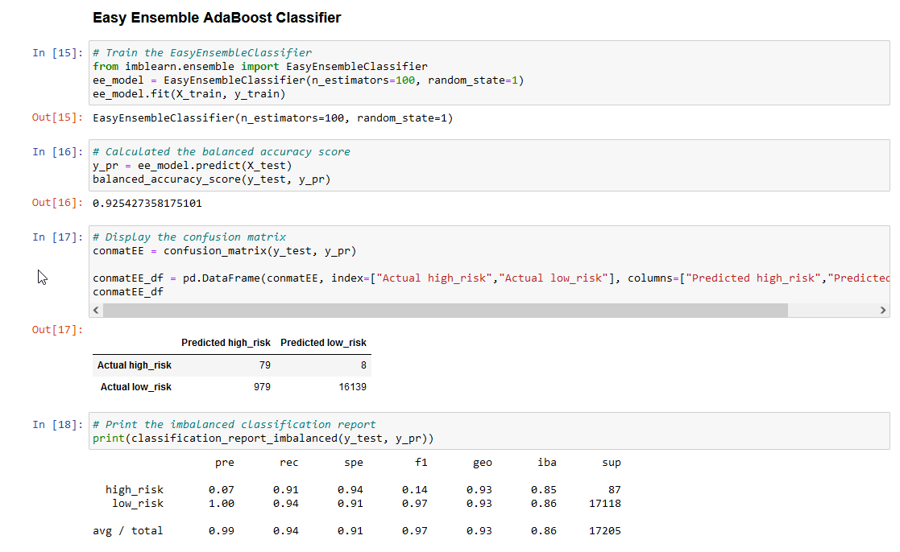

# Credit_Risk_Analysis

# Module 17 Challenge- _Deliverable 4_

This written analysis contains three sections:

**1. Overview of the analysis**

**2. Results**

**3. Summary**
 
## 1. Overview of the analysis

The aim of the analysis was to help Jill build an imbalanced-learn and scikit-learn libraries to build and evaluate models using resampling.

Using the credit card credit dataset from LendingClub, a peer-to-peer lending services company, the data was oversampled using the RandomOverSampler and SMOTE algorithms, and undersampled using the ClusterCentroids algorithm. Then, a combinatorial approach of over- and undersampling using the SMOTEENN algorithm was used. Next, two new machine learning models that reduce bias were compared, BalancedRandomForestClassifier and EasyEnsembleClassifier, to predict credit risk. Then the performance of these models were compared to determine which one should be used to predict credit risk.

## 2. Results

The the balanced accuracy score, the precision and recall scores of all six machine learning models are described below,

### *a. Random Oversampling Model*

* The Balanced accuracy score for this model is **64.13%**
* For `high_risk` cases, the precision was only **1%** with the recall at **60%** giving this model a F1 score of **2%**.
* For `low_risk` cases, the precision was almost **100%** with the recall at **68%** giving this model a F1 score of **81%**.
* Overall *(image below)*, the precision was **99%** with the recall at **60%** giving this model a F1 score of **81%**.

### *b. SMOTE Oversampling Model*

* The Balanced accuracy score for this model is **63.74%**
* For `high_risk` cases, the precision was only **1%** with the recall at **60%** giving this model a F1 score of **2%**.
* For `low_risk` cases, the precision was almost **100%** with the recall at **68%** giving this model a F1 score of **81%**.
* Overall *(image below)*, the precision was **99%** with the recall at **68%** giving this model a F1 score of **80%**.

### *c. Cluster Centroids Undersampling Model*

* The Balanced accuracy score for this model is significantly lower at **51.19%**
* For `high_risk` cases, the precision was only **1%** with the recall at **59%** giving this model a F1 score of **1%**.
* For `low_risk` cases, the precision was almost **100%** with the recall at **44%** giving this model a F1 score of **61%**.
* Overall *(image below)*, the precision was **99%** with the recall at **44%** giving this model a F1 score of **60%**.

### *d. Over and Under sampling Combined SMOTEENN model*

* The Balanced accuracy score for this model is **62.44%**
* For `high_risk` cases, the precision was only **1%** with the recall at **70%** giving this model a F1 score of **2%**.
* For `low_risk` cases, the precision was almost **100%** with the recall at **55%** giving this model a F1 score of **71%**.
* Overall *(image below)*, the precision was **99%** with the recall at **55%** giving this model a F1 score of **70%**.

### *e. BalancedRandomForestClassifier Ensemble model*

* The Balanced accuracy score for this model is high at **78.78%**
* For `high_risk` cases, the precision was high at **4%** with the recall at **67%** giving this model a high F1 score of **7%**.
* For `low_risk` cases, the precision was almost **100%** with the recall high at **91%** giving this model a high F1 score of **95%**.
* Overall *(image below)*, the precision was **99%** with the recall at **91%** giving this model a high F1 score of **95%**.

Additionally, the key variables in descending order of importance are sorted below,

*e. Sorted Feature Importance in descending order*

### *f. Easy Ensemble model*

* The Balanced accuracy score for this model is highest at **92.54%**
* For `high_risk` cases, the precision was high at **7%** with the recall high at **91%** giving this model the highest F1 score of **14%**.
* For `low_risk` cases, the precision was almost **100%** with the recall at **94%** giving this model a F1 score of **97%**.
* Overall *(image below)*, the precision was **99%** with the recall at **94%** giving this model the highest F1 score of **97%**.

## 3. Summary

### Results

From the results above, it is clear that the **EasyEnsembleClassifier model** provided the best results across multiple parameters. Its `balanced_accuracy` was highest at **92.54%** while its overall `precision` and `recall` rates were also highest at **99%** and **94%** respectively with the highest `F1_score` of **97%**. For the critical `high_risk` cases, the model yielded the best results with `precision` at **7%** and `recall` high at **91%**. Thus, this model would be the **preferred** among the others.

Overall, the two Ensemble models performed the best with **Easy Ensemble Classifier Model** outperforming the **Balanaced Random Forest Classifier Model**. Then both the Oversampled models performed slightly better than the Combined SMOTEEN model. The Undersampled **Cluster Centroids Model** performed the worst in terms of precision, sensitivity and accuracy overall. 
### Recommendation:

The **Easy Ensemble Model** performed the best and would be the preferred mdoel among the group. Especially among the critical `high_risk` group the model had a sensitivity/recall of 91% meaning over 9 out of 10 potential high_risk candidates would be detected by the model. This is the key criteria for `LendingClub` as they would not want to approve a loan to a high_risk candidate without proper due diligence. On the other hand falsely tagging `low_risk` individuals as `high_risk` has less implications on the business although it could potentially affect revenue negatively.

One concern with the dataset overall is the fact that the number of `high_risk` cases comprise of less than 1% of the dataset so the results are based on this premise. Thus `LendingClub` needs to be cognizant of this fact and the sensitivity of the `high_risk` group before moving ahead with the **Easy Ensemble Classifier Model**.